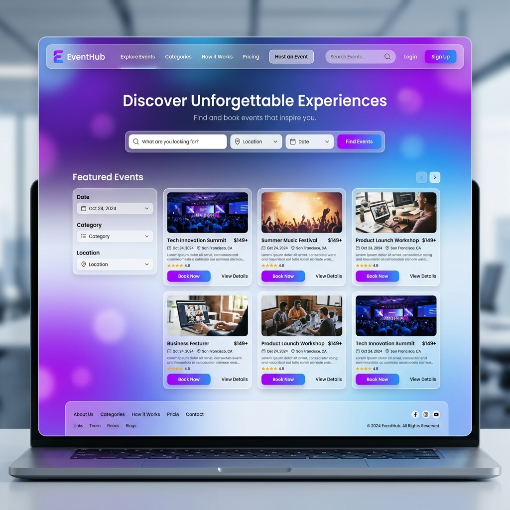

# Wireframes & UI Mockups

## Home Page Mockup

## Page Structure
1. **Home Page**:
   - Navigation: Logo, Home, Events, Login/Register.
   - Hero: Tagline, Search bar, Vibrant background.
   - Event Grid: Cards with Image, Date, Title, Location, Price, View Details.

2. **Event Details**:
   - Large image header.
   - Left column: Title, Description, Date/Time, Location.
   - Right sticky column: Booking card with Price, Seats, and "Book Now" button.

3. **Organizer Dashboard**:
   - Event list with status (Pending/Approved).
   - "Create Event" modal/form.

4. **Admin Panel**:
   - Table view for event approvals.
   - Action buttons for Approve/Reject.
